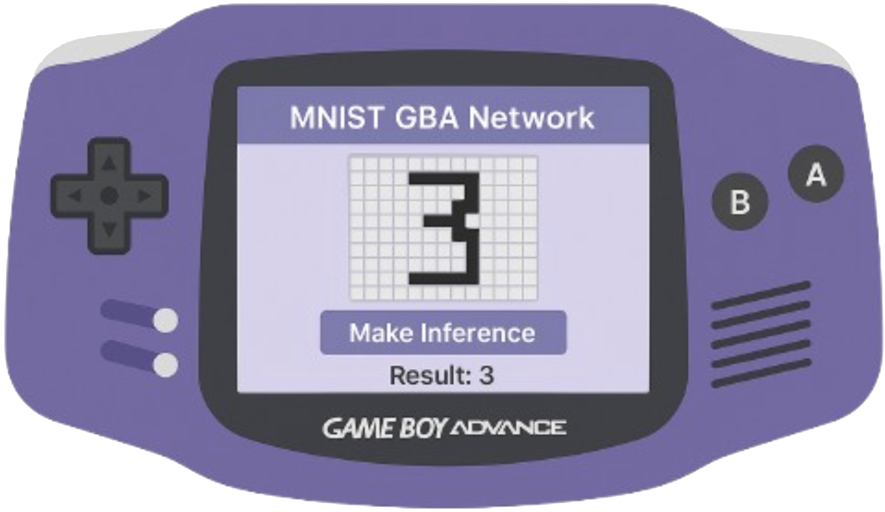

# Deep Learning Final Project | UNAM

## Introduction

This repository is based on [AntonioND's gba-bootstrap](https://github.com/AntonioND/gba-bootstrap).

It includes all the source code you need to get started with your final project. After compiling the project successfully, you should see a screen similar to the one below:

## Instructions

You need the ``gcc-arm-none-eabi`` toolchain. If you're on Linux you can just
use your package manager. For example, in Ubuntu:

.. code:: bash

    sudo apt install gcc-arm-none-eabi

This will add the compiler to your ``PATH`` as well.

You can also download prebuilt binaries from `Arm's GNU toolchain downloads
website`_. In this case, you will need to manually add this toolchain to your
``PATH``.

Then, from the folder of either of the samples, type:

.. code:: bash

    make

That's all!

Organization
------------

For both samples the organization is the same:

- ``Makefile``: Global makefile.

- ``gbafix``: Tool used to fill the checksums and other required fields of the
  ROM header.

- ``source``: All the source code of the game goes here, including yours.

- ``source/sys``: Files required by the C/C++ runtime.

- ``source/sys/gba_cart.ld``: Linker script that describes how code and data
  sections are placed in the ROM and at runtime on the GBA.

- ``source/sys/gba_crt0.s``: Initialization code that loads each section into
  the right location in RAM.

- ``source/sys/syscalls.c``: Implementation of system calls. They are all
  stubbed, so you can't use things like ``printf()`` or ``fopen()`` unless you
  implement them, which isn't usually worth the effort on GBA. For more
  information, check: https://sourceware.org/newlib/libc.html#Syscalls

.. _Arm's GNU toolchain downloads website: https://developer.arm.com/tools-and-software/open-source-software/developer-tools/gnu-toolchain/gnu-rm/downloads